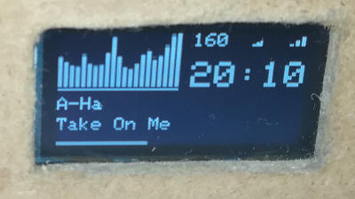

# The Project Has Moved! 

The vol_oled project has been expanded and renamed to mpd_oled. Its new
location is

   <https://github.com/antiprism/mpd_oled>

The mpd_oled project works with a number of MPD-based players.

vol_oled will receive no more updates, please use mpd_oled instead.

The original README text follows...


# Volumio OLED Spectrum Display for Raspberry Pi

The vol_oled program displays an information screen including a music
frequency spectrum on an OLED screen connected to a Raspberry Pi running
Volumio or MPD (and a time display when no music is playing).


It supports a variety of I2C and SPI 128x64 OLED displays.

The aim of this project is to share what has worked for me, using a 4-pin
I2C SSH1106 OLED with a Raspberry Pi Zero W. The code and installation
instructions should be considered rough and untested.


## Build and install cava

vol_oled uses Cava, a bar spectrum audio visualizer, to calculate the spectrum
   
   <https://github.com/karlstav/cava>

The commands to download, build and install Cava are as follows. Note that
the the command to install packages is different to the one given in the Cava
instructions. It installs extra packages needed for the build and does not
install the Pulseaudio development package.
```
   sudo apt-get update
   sudo apt-get install git-core autoconf make libtool libfftw3-dev libasound2-dev libncursesw5-dev
   git clone https://github.com/karlstav/cava
   cd cava
   ./autogen.sh
   ./configure
   make
   sudo make install
```

## System settings

Configure your system to enable I2C or SPI, depending on how your OLED
is connected.

The I2C bus speed on your system may be too slow for a reasonable update
speed. I use a SSH1106 display and set a higher bus speed by adding the
following line to /boot/config.txt
```
   dtparam=i2c_arm_baudrate=400000
```
And then restart the Pi.

The audio output needs to be copied to a named pipe, where Cava can
read it and calculate the spectrum. Edit /etc/mpd.conf
```
   sudo nano /etc/mpd.conf
```
And add the following lines at the end
```
audio_output {
    type                    "fifo"
    name                    "spec_fifo"
    path                    "/tmp/mpd_vol_oled"
    format                  "44100:16:2"
    buffer_time             "20000"
}
```
Restart mpd
```
   sudo systemctl restart mpd
```
Change buffer_time if you need to synchronise the spectrum display
and the audio on your system. Restart mpd after any changes.

If the vol_oled clock does not display the local time then you may need
to set the system time zone. The following command will run a console
based application where you can specify your location
```
sudo dpkg-reconfigure tzdata
```


## Build and install vol_oled

Install the packages needed to build the program
```
   sudo apt install build-essential git-core autoconf make libtool libi2c-dev i2c-tools lm-sensors libcurl4-openssl-dev libmpdclient-dev libjsoncpp-dev
```
Clone the source repository
```
   git clone https://github.com/antiprism/vol_oled
```
Change to the source directory and build the program
```
   cd vol_oled
   make
```
Check the program works correctly by running it while playing music.
The OLED type MUST be specified with -o from the following list:
    1 - Adafruit SPI 128x64,
    3 - Adafruit I2C 128x64,
    4 - Seeed I2C 128x64,
    6 - SH1106 I2C 128x64.

E.g. the command for a generic I2C SH1106 display (OLED type 6) with
a display of 10 bars and a gap of 1 pixel between bars and a framerate
of 20Hz is
```
   sudo ./vol_oled -o 6 -b 10 -g 1 -f 20
```
For I2C OLEDs you may need to specify the I2C address, find this by running,
e.g. 'sudo i2cdetect -y 1' and specify the address with vol_oled -a,
e.g. 'vol_oled -o6 -a 3d ...'. If you have a reset pin connected, specify
the GPIO number with vol_oled -r, e.g. 'vol_oled -o6 -r 24 ...'. (For, SPI
OLEDs, edit display.cc to include your connection details, if this works
out I will provide options for these parameters.)

Once the display is working, edit the file vol_oled.service to include
your OLED type number with the vol_oled command, and any other options.
Then run
```
   sudo bash install.sh
```
This will copy the program to /usr/local/bin and add a systemd service
to run it and start it running. You can start, stop, disable, etc the
service with commands like
```
   sudo systemctl start vol_oled
```
If you wish to change vol_oled parameters later then edit vol_oled.service
to include the changes and rerun install.sh.

## Synchronisation

The OLED needs to be able to refresh faster than Cava. If this is not
the case then try to improve the refresh rate of the OLED bus, possibly
by a setting in /boot/config.txt, otherwise lower the Cava framerate with
vol_oled -f.

If there is a minor synchronisation issue, change the buffer_time for the
audio copy fifo in /etc/mpd.conf.


## Credits

C.A.V.A. is a bar spectrum audio visualizer: <https://github.com/karlstav/cava>

OLED interface based on ArduiPI_OLED: <https://github.com/hallard/ArduiPi_OLED>
(which is based on the Adafruit_SSD1306, Adafruit_GFX, and bcm2835 library
code).


